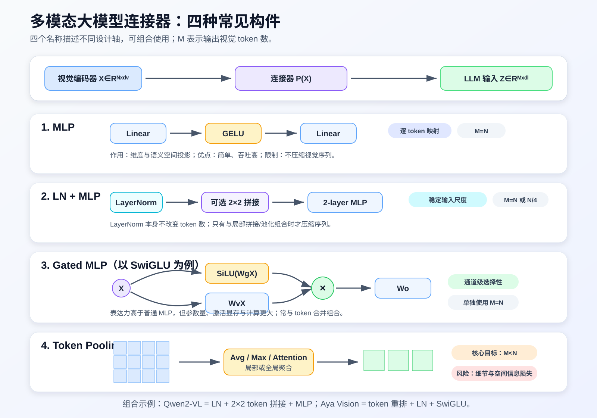

# Multimodal Connector Guide

一份关于多模态大模型连接器的中文技术文档，系统介绍：

- MLP Connector
- LayerNorm + MLP
- Gated MLP / GLU / SwiGLU
- Token Pooling、Token Merge 与 Attention Pooling

文档从视觉特征如何变成 LLM 可读取的伪视觉 token 开始，进一步讨论模态鸿沟、训练损失、连接器结构、token 压缩、推理复杂度、工程选型和 PyTorch 参考实现。

## 阅读文档

[多模态大模型连接器技术文档](./多模态大模型连接器技术文档.md)

## 主要内容

- 常用缩写、符号与术语表
- 连接器的端到端工作原理
- MLP、LN+MLP、Gated MLP、Token Pooling 的公式与特点
- LLaVA-1.5、Qwen2-VL、Aya Vision、MM1 等实例
- token 数对 prefill、decode、KV Cache 和 TTFT 的影响
- 训练阶段、label mask、位置编码与公平评估
- PyTorch 最小参考实现

## 资料与图片说明

仓库中的原创文字和结构示意图用于技术学习与交流。论文局部截图来自 LLaVA-1.5 与 MM1，仅用于技术评论和教学说明，其权利归论文作者及原出版方所有。详细出处见正文和 [NOTICE](./NOTICE.md)。
