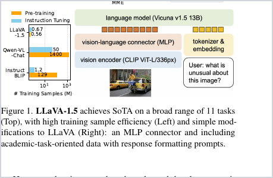
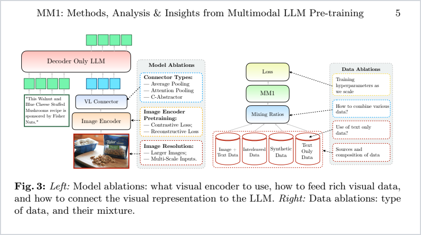
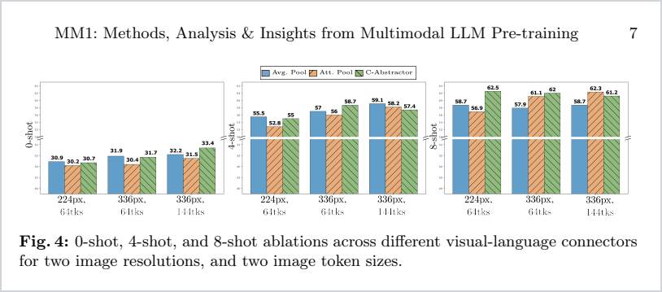

# 多模态大模型中的连接器：MLP、LN+MLP、Gated MLP 与 Token Pooling

> 版本：2026-08-27<br>
> 范围：以“视觉编码器 → 连接器 → 自回归大语言模型”的视觉语言模型为主；结论同样可迁移到音频、视频等连续特征接入 LLM 的场景。

## 摘要

多模态大模型中的连接器（connector，也常称 projector、adapter 或 vision-language connector）位于模态编码器与大语言模型之间。它不只是把视觉特征从维度 `d_v` 映射到 LLM 的词向量维度 `d_l`，还可能承担特征归一化、模态分布对齐、视觉 token 压缩、空间重排和计算预算控制等任务。

本文讨论四种常见构件：MLP、LN+MLP、Gated MLP 和 Token Pooling。需要先强调：**它们不是互斥的四个“模型类别”，而是可以组合的设计轴。**例如，Qwen2-VL 的 PatchMerger 可概括为“LayerNorm + 相邻 2×2 token 拼接 + MLP”；Aya Vision 的投影器则同时包含 token 重排/压缩、LayerNorm 和 SwiGLU 门控 MLP。


## 0. 缩写、符号与常用术语

### 0.1 模型与总体架构

| 缩写/术语 | 英文全称 | 中文含义 | 在本文中的含义 |
|---|---|---|---|
| LLM | Large Language Model | 大语言模型 | 接收文本 embedding 和视觉 embedding，并自回归生成文本的语言主干 |
| LM | Language Model | 语言模型 | LLM 的上位概念；本文多数场景指 decoder-only Transformer |
| MLLM | Multimodal Large Language Model | 多模态大模型 | 能共同处理文本、图像、视频、音频等两种及以上模态的大模型 |
| LMM | Large Multimodal Model | 大型多模态模型 | 与 MLLM 常混用；LLaVA-1.5 论文采用此称呼 |
| VLM | Vision-Language Model | 视觉语言模型 | 联合处理图像/视频与文本的模型，规模不一定达到“LLM”级别 |
| LVLM | Large Vision-Language Model | 大型视觉语言模型 | 以大语言模型为核心的 VLM，Qwen2-VL 论文使用该称呼 |
| VE | Vision Encoder | 视觉编码器 | 将图像转换为 patch 特征的编码器，例如 ViT、CLIP ViT、SigLIP2 |
| ViT | Vision Transformer | 视觉 Transformer | 将图像切成 patch，并用 Transformer 编码为视觉 token 序列 |
| CLIP | Contrastive Language-Image Pre-training | 对比式语言-图像预训练 | 通过图文对比学习获得语义对齐的图像与文本编码器 |
| SigLIP | Sigmoid Loss for Language-Image Pre-training | 使用 sigmoid 损失的图文预训练方法 | 常作为现代 MLLM 的视觉编码器；SigLIP2 是其后续版本 |
| Decoder-only | Decoder-only Transformer | 仅解码器架构 | 使用因果注意力按 token 逐步预测后续文本，LLaMA、Qwen 等属于此类 |
| E2E | End-to-End | 端到端 | 视觉编码器、连接器与 LLM 联合参与反向传播和参数更新 |

### 0.2 连接器、投影层与激活函数

| 缩写/术语 | 英文全称 | 中文含义 | 说明 |
|---|---|---|---|
| Connector | Multimodal/Vision-Language Connector | 多模态/视觉语言连接器 | 模态编码器与 LLM 之间的桥接模块，是本文的总称 |
| Projector | Vision/Multimodal Projector | 视觉/多模态投影器 | 强调把特征投影到 LLM embedding 空间；很多代码中与 connector 同义 |
| Adapter | Multimodal Adapter | 多模态适配器 | 更宽泛，既可指输入连接器，也可指插入 LLM 层内的小型适配模块 |
| VL Connector | Vision-Language Connector | 视觉-语言连接器 | 视觉连接器的常用简称 |
| Linear / FC | Linear / Fully Connected Layer | 线性层/全连接层 | 仿射变换 `y=Wx+b`；逐 token 使用时不会改变 token 数 |
| MLP | Multi-Layer Perceptron | 多层感知机 | 本文通常指 `Linear → 激活 → Linear` 的两层前馈网络 |
| FFN | Feed-Forward Network | 前馈网络 | Transformer 中逐 token 的 MLP；在一些代码和论文中与 MLP 近似同义 |
| LN | Layer Normalization | 层归一化 | 对单个 token 的通道维计算均值和方差，再做可学习缩放和平移 |
| RMSNorm | Root Mean Square Layer Normalization | 均方根归一化 | 不减均值、按均方根缩放；常见于 LLaMA 系语言模型 |
| Gated MLP | Gated Multi-Layer Perceptron | 门控多层感知机 | 使用内容分支和门控分支的乘法交互，动态选择通道信息 |
| GLU | Gated Linear Unit | 门控线性单元 | `门函数(一条分支) × 内容分支` 的通用结构 |
| GEGLU | GELU Gated Linear Unit | GELU 门控线性单元 | 使用 GELU 作为门函数的 GLU 变体 |
| SwiGLU | Swish Gated Linear Unit | Swish/SiLU 门控线性单元 | 使用 SiLU/Swish 作为门函数；Aya Vision 连接器采用这一形式 |
| GELU | Gaussian Error Linear Unit | 高斯误差线性单元 | 平滑非线性激活，LLaVA-1.5 与 Qwen2-VL projector 中使用 |
| SiLU / Swish | Sigmoid Linear Unit | Sigmoid 线性单元 | `SiLU(x)=x·sigmoid(x)`；SwiGLU 的门控激活 |
| MoE | Mixture of Experts | 混合专家 | 通过路由器为 token 选择少量专家；“门控 MLP”不自动等同于 MoE |
| Q-Former | Querying Transformer | 查询 Transformer | 用一组可学习 query 通过 cross-attention 从视觉特征中提取固定数量 token |
| Resampler | Perceiver-style Resampler | 重采样器 | 用可学习 latent/query 把可变长视觉序列压缩成固定长度表示 |
| C-Abstractor | Convolutional Abstractor | 卷积抽象器 | Honeybee/MM1 涉及的局部保持型连接器，结合卷积/ResNet 与自适应 pooling |
| D-Abstractor | Deformable Abstractor | 可变形抽象器 | 使用可变形注意力选择空间位置的视觉连接器 |

### 0.3 token、空间结构与注意力

| 缩写/术语 | 英文全称 | 中文含义 | 说明 |
|---|---|---|---|
| Patch | Image Patch | 图像块 | ViT 将图像切分得到的固定或动态大小区域 |
| Visual/Image Token | Visual/Image Token | 视觉/图像 token | patch 经视觉编码器和连接器处理后的向量；它是连续 embedding，不是词表中的离散文字编号 |
| Text Token | Text Token | 文本 token | tokenizer 将文本切分后对应的离散词表单元 |
| Pseudo Token | Pseudo Token | 伪 token | 不来自文本词表、但被组织成与文本 embedding 相同形状并送入 LLM 的连续向量 |
| Embedding | Embedding Vector | 嵌入向量 | token 在连续向量空间中的表示 |
| Hidden State | Hidden Representation | 隐状态 | 网络中间层输出的 token 表示 |
| Hidden Size / Dim | Hidden Dimension | 隐藏维度 | 每个 token 向量的通道数，例如 `d_v`、`d_l` |
| CLS Token | Classification Token | 分类 token | 一些 ViT 在序列开头加入的全局汇总 token；MLLM 常更多使用 patch token |
| BOS / EOS | Beginning/End of Sequence | 序列起始/结束 token | 标记文本序列边界的特殊 token |
| Pooling | Feature/Token Pooling | 特征/token 池化 | 将多个 token 聚合成更少 token 的操作 |
| AvgPool | Average Pooling | 平均池化 | 对窗口内 token 取均值，近似低通滤波 |
| MaxPool | Maximum Pooling | 最大池化 | 对每个通道取窗口最大值，偏向保留强响应 |
| Adaptive Pooling | Adaptive Pooling | 自适应池化 | 输入大小可变，但输出固定的 `h_o×w_o` 网格 |
| Attention Pooling | Attention Pooling | 注意力池化 | 用可学习 query 对视觉 token 加权汇总 |
| Token Merge | Token Merging | token 合并 | 把相邻或相似 token 聚为更少 token；可用平均、加权或通道拼接实现 |
| Token Pruning | Token Pruning | token 剪枝 | 直接删除被判定为不重要的 token；与 pooling 的聚合不同 |
| Token Compression | Token Compression | token 压缩 | Pooling、merge、pruning、resampler 等降低视觉序列长度方法的总称 |
| Pixel Shuffle | Pixel Shuffle/Rearrangement | 像素/特征重排 | 在空间维与通道维之间重排数据；部分 MLLM 代码用该名称实现空间降采样式 token 重排 |
| MHA | Multi-Head Attention | 多头注意力 | 将注意力拆分为多个头，并行学习不同关系 |
| SA | Self-Attention | 自注意力 | Query、Key、Value 来自同一序列 |
| CA / X-Attn | Cross-Attention | 交叉注意力 | Query 与 Key/Value 来自不同序列或模态 |
| Q/K/V | Query/Key/Value | 查询/键/值 | 注意力机制的三类投影表示；此处的 Q 与 Q-Former 名称中的 Query 含义一致 |
| RoPE | Rotary Position Embedding | 旋转位置编码 | 通过旋转 Q/K 向量编码相对位置 |
| 2D-RoPE | Two-Dimensional RoPE | 二维旋转位置编码 | 分别编码图像高度与宽度位置 |
| M-RoPE | Multimodal RoPE | 多模态旋转位置编码 | Qwen2-VL 将时间、高度、宽度位置分量统一到多模态序列中 |

### 0.4 训练、推理与评估

| 缩写/术语 | 英文全称 | 中文含义 | 说明 |
|---|---|---|---|
| PT | Pre-training | 预训练 | 在大规模数据上学习通用能力；本文也会把仅训练 connector 的初始阶段称为对齐预训练 |
| CPT | Continued Pre-training | 持续预训练 | 在已有模型上继续用图文或交错数据训练 |
| SFT | Supervised Fine-Tuning | 监督微调 | 使用多模态指令-回答数据训练模型遵循指令 |
| PEFT | Parameter-Efficient Fine-Tuning | 参数高效微调 | 只更新少量参数的微调方法总称 |
| LoRA | Low-Rank Adaptation | 低秩适配 | 以低秩增量矩阵更新部分线性层的 PEFT 方法 |
| NTP | Next-Token Prediction | 下一 token 预测 | 自回归 LLM 的核心训练目标 |
| CE | Cross-Entropy Loss | 交叉熵损失 | 下一 token 预测常用损失 |
| NLL | Negative Log-Likelihood | 负对数似然 | 最大化正确序列概率的等价最小化目标 |
| Frozen / Unfrozen | Frozen / Trainable | 冻结/解冻 | 冻结参数不更新；解冻参数参与反向传播和优化 |
| Prefill | Prompt Prefilling | 预填充 | 一次处理全部图像和提示 token，并建立 KV Cache 的推理阶段 |
| Decode | Autoregressive Decoding | 自回归解码 | 利用 KV Cache 每次生成一个或少量新 token 的阶段 |
| KV Cache | Key-Value Cache | 键值缓存 | 保存历史 token 在各注意力层的 K/V，避免解码时重复计算 |
| TTFT | Time to First Token | 首 token 延迟 | 从请求开始到生成第一个文本 token 的时间，受视觉 token 数和 prefill 影响明显 |
| FLOPs | Floating-Point Operations | 浮点运算次数 | 衡量理论计算量；不完全等价于真实延迟 |
| MACs | Multiply-Accumulate Operations | 乘加运算次数 | 线性层和卷积计算量的常用统计方式 |
| Throughput | Throughput | 吞吐量 | 单位时间处理的样本数或 token 数 |
| Latency | Latency | 延迟 | 单次请求耗时，常分为视觉编码、prefill 和 decode |
| VRAM | Video Random-Access Memory | 显存 | 模型权重、激活、梯度和 KV Cache 占用的 GPU 内存 |
| VQA | Visual Question Answering | 视觉问答 | 根据图像回答问题的任务类别 |
| OCR | Optical Character Recognition | 光学字符识别 | 识别图像中的文字；对视觉 token 压缩非常敏感 |
| Grounding | Visual Grounding | 视觉定位/指代定位 | 将文本实体与图像区域、点或框对应起来 |
| ICL | In-Context Learning | 上下文学习 | 不更新参数，仅通过提示中的示例完成新任务 |
| CoT | Chain-of-Thought | 思维链 | 通过中间推理步骤提高复杂任务表现 |

### 0.5 本文符号

| 符号 | 含义 |
|---|---|
| `B` | batch size，批大小 |
| `N` | 视觉编码器输出 token 数 |
| `M` | 连接器输出、送入 LLM 的视觉 token 数 |
| `T` | 文本提示 token 数 |
| `d_v` | 视觉编码器输出维度 |
| `d_h` | 连接器内部隐藏维度 |
| `d_l` | LLM 输入 embedding/hidden size |
| `H,W` | 视觉 token 网格的高度和宽度，通常 `N=H×W` |
| `r` | 空间压缩倍率；`r×r` 合并后通常 `M≈N/r²` |
| `K` | 注意力 pooling 中可学习 query 的数量，通常也是输出 token 数 |
| `θ` | 连接器的可训练参数集合 |

## 1. 连接器的端到端原理

### 1.1 从图像到“伪视觉 token”

给定图像 `I`，视觉编码器 `E_v` 先输出连续视觉特征：

$$
X=E_v(I),\qquad X\in\mathbb{R}^{B\times N\times d_v}.
$$

连接器 `P_θ` 再将其变换为与 LLM 输入维度一致的连续向量：

$$
Z=P_\theta(X),\qquad Z\in\mathbb{R}^{B\times M\times d_l}.
$$

文本提示经过 tokenizer 和 embedding table 得到：

$$
E_{text}\in\mathbb{R}^{B\times T\times d_l}.
$$

随后把视觉表示插入文本序列的 `<image>` 占位位置，或直接与文本 embedding 拼接：

$$
S=[E_{prefix};Z;E_{suffix}]\in\mathbb{R}^{B\times(T+M)\times d_l}.
$$

对 LLM 而言，`Z` 的形状与普通词向量一致，因此视觉向量可以作为一串 **伪视觉 token（pseudo visual tokens）** 参与自注意力。但它们通常没有对应的词表 ID，也不是把图片先“翻译成文字”；它们是由图像端连续计算出来的 embedding。

### 1.2 为什么视觉特征不能直接送入 LLM

视觉编码器和 LLM 的表示空间存在至少四种差异：

1. **维度差异**：视觉特征可能是 768、1024 或 1152 维，而 LLM hidden size 可能是 2048、4096 或更高。
2. **数值分布差异**：两边的均值、方差、范数和各维相关性不同，直接拼接会让注意力层面对异常尺度。
3. **语义基底差异**：视觉编码器通常针对图像分类、对比学习或自监督目标训练；LLM embedding 则围绕词义、语法和生成目标组织。
4. **序列结构差异**：视觉特征原本位于二维空间或三维时空网格，LLM 接收的是一维因果序列。

连接器的“对齐”不是要求一个 patch 向量等于某个具体单词向量，而是学习一种变换，使这些视觉向量进入 LLM 后能够通过已有注意力和 FFN 层影响正确的文本生成。

### 1.3 连接器如何从语言损失中学会视觉语义

给定图像、提示和目标回答 `y_1,…,y_L`，训练目标通常仍是下一 token 预测：

$$
\mathcal{L}_{NTP}
=-\sum_{t=1}^{L}\log p_\phi
\left(y_t\mid I,\text{prompt},y_{<t}\right),
$$

其中 `φ` 表示 LLM 参数。若视觉编码器和 LLM 均被冻结，梯度只能更新连接器 `θ`：

$$
\nabla_\theta\mathcal{L}
=\frac{\partial\mathcal{L}}{\partial Z}
\frac{\partial P_\theta(X)}{\partial\theta}.
$$

这意味着连接器会逐渐学会：哪些视觉方向应映射到 LLM 已有的语义子空间、哪些 patch 应保留、输出尺度应多大，以及哪些视觉信息有助于降低后续文本的预测损失。它不是独立完成视觉理解，而是让视觉证据能够被 LLM 已有的语言与推理能力读取。

只训练一个小连接器的优点是便宜且不易破坏原模型；缺点是所有模态差异都被压在狭窄瓶颈中。当数据域与视觉编码器预训练域差异很大，或任务需要精细空间推理时，通常还要解冻部分视觉编码器或 LLM。

### 1.4 连接器解决的五类问题

连接器通常承担五类职责：

1. **维度适配**：把 `d_v` 映射为 `d_l`，使视觉特征可以与文本 token embedding 拼接。
2. **表示空间对齐**：让视觉向量的尺度、分布和语义方向更适合被预训练 LLM 消费。
3. **token 预算控制**：将 `N` 压缩为 `M`，降低预填充阶段的计算量和 KV Cache 占用。
4. **空间或时间重组**：把二维 patch 网格、视频帧或音频帧转换为适合一维序列建模的表示。
5. **训练瓶颈**：在冻结视觉编码器和 LLM 时，连接器是跨模态对齐的主要可训练接口。

### 1.5 连接器设计的三个正交轴

连接器设计可以沿三个相互独立的轴理解：

| 设计轴 | 选项 | 核心问题 |
|---|---|---|
| token 数量 | 保持 `M=N` / 压缩 `M<N` / 动态 `M` | 要保留多少视觉细节？ |
| token 交互 | 逐 token / 局部窗口 / 全局查询 | 连接器内是否允许视觉 token 彼此交换信息？ |
| 通道变换 | Linear / MLP / LN+MLP / Gated MLP | 如何完成维度和分布对齐？ |

因此，“Token Pooling + Gated MLP”或“LN + Token Merge + MLP”都是合理且常见的组合。

## 2. 四类连接器对比

| 构件 | 典型结构 | 是否跨 token 交互 | 默认是否压缩 token | 主要优点 | 主要风险 | 代表实例 |
|---|---|---:|---:|---|---|---|
| MLP | `Linear → GELU → Linear` | 否 | 否 | 简单、并行度高、实现成熟 | 高分辨率下视觉序列过长 | LLaVA-1.5 |
| LN+MLP | `LN → MLP`，可与局部拼接组合 | 单独使用时否 | 单独使用时否 | 输入尺度稳定，减轻编码器/LLM分布差异 | LN 可能抹去部分幅值信息；仍需另行压缩 | Qwen2-VL PatchMerger |
| Gated MLP | `Wo(φ(WgX) ⊙ WvX)` | 否 | 否 | 通道选择性强，表达力高 | 参数、FLOPs 和激活显存较高 | Aya Vision 的 SwiGLU projector |
| Token Pooling | `Pool(X) → Linear/MLP` | 局部或全局 | 是 | 显著减少预填充与 KV Cache 成本 | 小目标、OCR、空间关系可能受损 | MM1 的平均/注意力 pooling 消融 |

## 3. MLP 连接器

### 3.1 结构

最常见的是两层逐 token MLP：

$$
Z=W_2\,\sigma(W_1X+b_1)+b_2,
$$

其中 `W1: d_v → d_h`，`W2: d_h → d_l`，激活函数通常为 GELU。每个视觉 token 独立经过同一组权重，因此：

$$
M=N.
$$

参数量约为：

$$
d_vd_h+d_hd_l,
$$

忽略 bias 后，计算量约为：

$$
O\left(BN(d_vd_h+d_hd_l)\right).
$$

### 3.2 为什么两层 MLP 能完成跨模态投影

第一层线性变换不只是“改维度”，还可以理解为对视觉特征做可学习的基变换、旋转、缩放和通道混合。若只使用单层 Linear，整个连接器只能表示仿射映射：

$$
z=Wx+b.
$$

两层 MLP 在中间加入非线性 `σ`，可把视觉空间分成多个响应区域，对不同类型的视觉模式采用不同的局部映射。例如，同一通道组合对“文字边缘”“物体纹理”和“全局语义”可以产生不同激活，而不必由同一个全局线性关系解释。

从几何角度看，MLP 做了三件事：

1. `W1` 把视觉特征展开到连接器隐藏空间；
2. GELU 等非线性对不同区域进行软选择；
3. `W2` 把筛选和重组后的特征投影到 LLM 的 embedding 基底。

MLP 的参数在所有 token 之间共享，因此它保持输入序列长度和 token 顺序。第 `i` 个输出只依赖第 `i` 个输入：

$$
z_i=f_\theta(x_i).
$$

这种设计能保留空间排列，却不能在连接器内部回答“两个 patch 之间是什么关系”。跨 patch 关系要等视觉编码器或后续 LLM 的 self-attention 来建模。这也是 MLP 吞吐高、但在局部融合和 token 压缩方面能力有限的根本原因。

### 3.3 类型、作用与特点

- **类型**：可学习、逐 token、token 数保持型、无显式跨 token 交互。
- **作用**：完成特征维度变换和非线性语义映射。
- **优点**：结构短、训练稳定、GPU 友好；能够保留所有 patch token，不会在连接器内主动丢弃空间细节。
- **缺点**：当输入分辨率或图像数量增加时，视觉 token 数原样进入 LLM，预填充成本和 KV Cache 会迅速上升；连接器本身也不建模 patch 之间的关系。

LLaVA-1.5 将原始 LLaVA 的单层线性投影改为两层 MLP，并报告了更强的多模态能力。论文第 3 页明确说明，该修改提升了连接器的表示能力。[论文：Improved Baselines with Visual Instruction Tuning](https://arxiv.org/abs/2310.03744)



*图 1：裁自 LLaVA-1.5 论文 Figure 1。图中展示了 CLIP ViT-L/336px → MLP connector → Vicuna 的基本路径。版权归原作者所有，此处仅作技术评论与结构说明。*

### 3.4 适用场景

MLP 适合作为可靠基线，尤其适用于：视觉 token 数已经较小、OCR/小目标细节优先、训练预算有限、希望尽量少改动 LLM 输入接口的场景。若 `N` 很大，通常应在 MLP 前增加 pooling、token merge 或 pixel shuffle。

## 4. LN+MLP 连接器

### 4.1 结构

最小形式为：

$$
\hat X=\mathrm{LN}(X),\qquad
Z=W_2\,\sigma(W_1\hat X+b_1)+b_2.
$$

LayerNorm 对每个 token 的通道维做标准化。若只增加 LN，token 数仍保持 `M=N`。它的主要价值是让不同视觉编码器、不同分辨率或不同训练阶段产生的特征，以更稳定的尺度进入投影层。

对一个 `d_v` 维 token `x`，LayerNorm 的计算为：

$$
\mu=\frac{1}{d_v}\sum_{k=1}^{d_v}x_k,
\qquad
\sigma^2=\frac{1}{d_v}\sum_{k=1}^{d_v}(x_k-\mu)^2,
$$

$$
\mathrm{LN}(x)_k
=\gamma_k\frac{x_k-\mu}{\sqrt{\sigma^2+\epsilon}}+\beta_k.
$$

其中 `γ` 和 `β` 是可学习参数，`ε` 用于数值稳定。

### 4.2 LN 为什么有助于连接器训练

视觉编码器可能在 CLIP/SigLIP 的对比目标下训练，而 LLM 输入 embedding 来自完全不同的语言目标。不同分辨率、裁剪策略和视觉层选择也会改变 `X` 的范数。LN 在投影前消除每个 token 的整体偏移和尺度差异，使第一层 Linear 接收到更稳定的输入条件，常带来以下效果：

- 降低少数大幅值通道主导梯度的概率；
- 让不同图片和不同 token 的输入尺度更一致；
- 改善混合精度训练时的数值范围；
- 减轻替换视觉编码器或改变分辨率造成的分布漂移。

但 LN 只解决统计尺度，不直接解决语义错位。若视觉编码器没有产生任务所需信息，LN 无法凭空补充信息。

LN 的放置位置也会改变行为：

- **先 LN、后局部拼接**：每个 patch 独立归一化，再把 `r×r` token 拼成一个长向量；Qwen2-VL 属于这种形式。
- **先局部合并、后 LN**：整个局部窗口作为一个联合向量归一化，窗口成员之间会共享归一化统计。
- **MLP 后再 LN**：直接控制送入 LLM 的输出尺度，但可能限制 connector 使用幅值编码置信度的自由度。
- **残差块中的 Pre-Norm**：`x + MLP(LN(x))`，要求输入输出维度相同，适合堆叠更深连接器。

### 4.3 Qwen2-VL 的组合实例

Qwen2-VL 论文说明，ViT 后使用简单 MLP 将相邻 `2×2` 视觉 token 压为 1 个 token。公开实现中的 PatchMerger 顺序更具体：

1. 对每个视觉 token 做 LayerNorm；
2. 将空间上相邻的 `2×2` token 沿通道维拼接；
3. 经过 `Linear → GELU → Linear` 映射到 LLM hidden size。

可写为：

$$
u_{i,j}=\operatorname{Concat}\big(
\mathrm{LN}(x_{2i,2j}),
\mathrm{LN}(x_{2i+1,2j}),
\mathrm{LN}(x_{2i,2j+1}),
\mathrm{LN}(x_{2i+1,2j+1})
\big),
$$

$$
z_{i,j}=\mathrm{MLP}(u_{i,j}),\qquad M\approx N/4.
$$

这说明 Qwen2-VL 不是“只有 LN+MLP”，而是 **LN+MLP 与局部 token merge 的组合**。[Qwen2-VL 论文](https://arxiv.org/abs/2409.12191)；[Transformers 中的 PatchMerger 实现](https://github.com/huggingface/transformers/blob/main/src/transformers/models/qwen2_vl/modeling_qwen2_vl.py)

### 4.4 特点

- **优势**：改善数值尺度和优化稳定性；对冻结编码器尤其有用；与局部拼接组合时可同时降低 token 数。
- **代价**：LN 增加少量计算；局部拼接会把输入维度扩大为 `r²d_v`，后续第一层线性层的参数量随 `r²` 增加。
- **风险**：归一化可能削弱“向量幅值本身携带置信度”的信号；固定 `2×2` 合并也可能让极小文字或细粒度边界更难恢复。

## 5. Gated MLP 连接器

### 5.1 结构

Gated MLP 使用一条内容分支和一条门控分支。以 SwiGLU 为例：

$$
H_v=XW_v,
$$

$$
H_g=\mathrm{SiLU}(XW_g),
$$

$$
Z=(H_v\odot H_g)W_o.
$$

门控分支为每个 token、每个隐通道生成数据依赖的缩放系数。与普通两层 MLP 相比，它能选择性放大或抑制视觉特征维度，但通常需要两套输入投影，参数量和激活显存更高。SwiGLU 的一般形式来自 GLU 变体研究。[GLU Variants Improve Transformer](https://arxiv.org/abs/2002.05202)

### 5.2 门控为什么比普通激活更有表达力

普通 MLP 的中间表示是 `σ(WX)`；门控 MLP 则显式产生两条分支，并通过逐元素乘法形成二阶交互：

$$
h_j=\underbrace{(w_{v,j}^{\top}x)}_{\text{内容}}
\cdot
\underbrace{\mathrm{SiLU}(w_{g,j}^{\top}x)}_{\text{门控}}.
$$

因此，第 `j` 个隐藏通道的内容是否通过，不仅取决于该内容分支自身，还取决于另一组权重对同一输入的判断。它类似一个连续、可微的软开关：

- 当门值接近 0 时，相应内容被抑制；
- 当门值为正且较大时，相应内容被增强；
- SiLU 允许平滑梯度和少量负响应，不是硬二值开关。

对连接器而言，这种乘法交互可用于抑制视觉编码器中与语言生成无关的通道，并保留任务相关组合。但它仍然是逐 token 操作：门控的是 **特征通道**，不是从 `N` 个 token 中挑选 token。若需要 token 级路由，应另加 attention pooling、token pruning 或 MoE/router 类机制。

若 SwiGLU 的两条输入投影宽度均为 `d_h`，忽略 bias，其参数量近似为：

$$
2d_vd_h+d_hd_l,
$$

高于同隐藏宽度普通 MLP 的 `d_vd_h+d_hd_l`。工程上常适当缩小 `d_h`，使总参数量与普通 MLP 接近，再公平比较门控形式本身。

### 5.3 Aya Vision 的实现实例

Aya Vision 的公开实现采用：

`Pixel Shuffle/空间重排 → LayerNorm → Linear → SwiGLU → Linear`。

第一层线性输出被均分为内容分支 `x` 与门控分支 `gate`，随后计算 `SiLU(gate) ⊙ x`，再投影到文本模型 hidden size。其 token 压缩来自前面的空间重排，而不是门控乘法本身。因此，一个真实的 Aya Vision 连接器同时属于：

- token 合并/重排型；
- LN 预归一化型；
- Gated MLP 型。

参考：[Aya Vision 论文](https://arxiv.org/abs/2505.08751)；[Transformers 中的 AyaVisionMultiModalProjector](https://github.com/huggingface/transformers/blob/main/src/transformers/models/aya_vision/modeling_aya_vision.py)

### 5.4 特点

- **类型**：可学习、逐 token 通道门控；单独使用时 `M=N`。
- **优势**：比普通 MLP 具有更强的条件选择能力；对视觉编码器输出中“有用与无用通道混杂”的情况更灵活。
- **代价**：输入投影通常由一套增加到两套；训练和推理成本高于同 hidden width 的普通 MLP。
- **适用**：连接器容量是瓶颈、LLM 主干被冻结较多、希望增强非线性但不引入完整注意力模块的场景。

## 6. Token Pooling 连接器

### 6.1 基本结构

Token Pooling 的核心目标是将 `N` 个视觉 token 聚合为 `M` 个，且 `M<N`：

$$
\tilde X=\mathrm{Pool}(X),\qquad
Z=\mathrm{Proj}(\tilde X).
$$

常见子类型包括：

1. **平均/最大池化**：对局部窗口做固定聚合，几乎不增加参数；适合效率优先的系统。
2. **自适应二维池化**：无论输入网格大小如何，都输出固定的 `h_o×w_o` 网格，因此 `M=h_ow_o`。
3. **注意力池化**：用 `K` 个可学习 query 对全部视觉 token 做 cross-attention，输出 `M=K`；信息选择更灵活，但计算和参数更多。
4. **token merge / pixel shuffle**：把局部 token 沿通道维拼接或重排，再用线性层/MLP 压回目标维度。它不是经典的数值平均池化，但承担相同的序列压缩职责，并且在投影前保留了局部成员的独立通道。

### 6.2 Pooling 的核心原理：冗余、信息瓶颈与率失真权衡

ViT 的相邻 patch 通常高度相关：同一物体或同一背景会在多个 token 中产生相似表示。Token Pooling 利用这种冗余，把高密度视觉网格压缩成较短序列。其本质是一个有损或近似无损的信息瓶颈：

$$
X_{N\times d_v}\longrightarrow \tilde X_{M\times d_p},
\qquad M<N.
$$

更小的 `M` 意味着更低计算成本，但也意味着每个输出 token 必须承载更大空间区域的信息。这可以理解为“码率-失真（rate-distortion）”权衡：token 预算是码率，OCR、小目标、边界和精确位置误差是失真。

不同 pooling 的信息假设不同：

**局部平均池化**把 `r×r` 窗口视为局部平稳区域：

$$
\tilde x_{i,j}=\frac{1}{r^2}
\sum_{a=0}^{r-1}\sum_{b=0}^{r-1}x_{ri+a,rj+b}.
$$

它类似低通滤波，能抑制噪声，但也会平滑文字笔画和细边界。

**最大池化**逐通道保留最强响应：

$$
\tilde x_{i,j,k}=\max_{a,b}x_{ri+a,rj+b,k}.
$$

它更容易保留显著激活，但不同通道的最大值可能来自不同 patch，因此输出不一定对应一个真实空间位置。

**注意力池化**使用 `K` 个 query 汇总所有输入：

$$
A=\operatorname{softmax}\left(\frac{QK_X^{\top}}{\sqrt d}\right),
\qquad
\tilde X=AV_X.
$$

其输出长度由 query 数决定，`M=K`。它能根据训练目标学习“该保留什么”，但全局 query 未必天然保留二维邻接关系，而且 cross-attention 本身增加约 `O(BKNd)` 的计算。

**局部拼接/重排**不立即求平均，而是把成员保存在不同通道：

$$
u_{i,j}=\operatorname{Concat}{x_{ri+a,rj+b}\}_{a,b},
\qquad
z_{i,j}=Wu_{i,j}.
$$

在应用 `W` 之前，该重排是信息保真的；真正压缩发生在后续通道投影中。它通常比直接平均更有能力区分窗口内不同位置，但第一层线性层输入维度会扩大 `r²` 倍。

### 6.3 MM1 的系统消融

MM1 在统一训练设置下比较了平均池化、注意力池化和 C-Abstractor，并同时控制图像分辨率与视觉 token 数。论文把连接器放在 Image Encoder 与 Decoder-only LLM 之间：



*图 2：裁自 MM1 论文 Figure 3。其连接器候选包括 Average Pooling、Attention Pooling 与 C-Abstractor。版权归原作者所有。*

论文的受控实验显示：在其设置中，**图像分辨率和视觉 token 数通常比具体连接器类型更关键**；这不是“连接器结构无关紧要”的普遍定理，而是提醒研究者必须在相同分辨率、token 预算、训练数据和主干模型下比较连接器。[MM1 论文](https://arxiv.org/abs/2403.09611)



*图 3：裁自 MM1 论文 Figure 4。图中同时改变了 224/336 分辨率、64/144 token 和连接器类型，因此不能只看某一根柱子得出普遍结论。版权归原作者所有。*

### 6.4 效率收益

假设原始视觉 token 数为 `N=576`，文本上下文为 `T=128`。用 `2×2` 局部压缩得到 `M=144`。仅考虑标准全注意力预填充的二次项：

$$
\frac{(T+M)^2}{(T+N)^2}
=\frac{272^2}{704^2}
\approx 0.149.
$$

也就是说，**仅该二次项约减少 85%**。这不是端到端延迟的等比例保证，因为模型还包含线性层、MLP、视觉编码器、访存和 kernel 调度等成本；但 token 压缩通常也会线性降低解码阶段的视觉 KV Cache 占用。

更完整地看，设 LLM 层数为 `L`、hidden size 为 `d_l`、FFN 中间维度为 `d_ff`。忽略常数和批大小后：

- prefill self-attention 的主要计算项约为 `O((T+M)²d_l)`；
- prefill 中 LLM 的线性投影和 FFN 约为 `O((T+M)d_ld_ff)`；
- 每生成一个新 token，decode attention 需要读取约 `T+M+t` 个历史位置；
- KV Cache 随 `L(T+M)d_l` 近似线性增长，并为 K、V 各保存一份缓存。

因此，降低 `M` 同时影响首 token 延迟、长提示的 prefill、每步 decode 的历史读取量和 KV Cache。实际收益还取决于 FlashAttention、连续批处理、量化、GPU 利用率和连接器新增算子是否能高效融合。

### 6.5 风险

- 平均池化容易平滑小文字、细线和小目标；
- 全局注意力池化可能弱化显式二维邻接关系；
- 固定压缩率无法根据任务难度动态分配 token；
- 对多图和长视频，过度压缩会把不同区域或时间片混叠在一起。

若任务以 OCR、文档、图表、遥感或医学小病灶为主，应优先验证细粒度基准，而不能只看通用 VQA 平均分。TokenPacker 等后续工作采用粗到细局部注入，以缓解简单压缩的细节损失。[TokenPacker](https://arxiv.org/abs/2407.02392)

## 7. 如何选型

| 需求 | 推荐起点 | 原因 |
|---|---|---|
| 快速建立可靠基线 | 两层 MLP | 结构最简单，便于定位数据和训练问题 |
| 冻结视觉编码器与 LLM，仅训练桥接层 | LN+MLP 或 LN+Gated MLP | 先稳定特征尺度，再增加映射容量 |
| 高分辨率、多图、长视频 | Token Pooling/merge + MLP | 优先控制 LLM token 预算 |
| OCR、小目标、精细空间关系 | 低压缩率 MLP，或局部保真 merge | 避免过早平均掉细节 |
| 小模型但希望连接器更强 | LN + Gated MLP | 用较小模块增加通道选择性 |
| 输入分辨率变化大 | 自适应 pooling 或动态 token 策略 | 让输出 token 数可控 |
| 极致部署效率 | 固定局部 pooling + Linear/小 MLP | 参数少、算子规则、易于融合 |

一个稳妥的实验顺序是：

1. 先建立不压缩的两层 MLP 基线；
2. 增加 LN，观察训练稳定性、特征范数和收敛速度；
3. 固定其他变量，只改变 token 压缩率；
4. 在相同 `M` 下比较平均池化、局部拼接和注意力池化；
5. 最后再比较普通 MLP 与 SwiGLU，避免把“容量提升”和“token 预算变化”混在一起。

## 8. 训练与实现注意事项

### 8.1 对齐阶段

常见两阶段训练为：

- **阶段 1：特征对齐**。冻结视觉编码器和 LLM，只训练连接器，使视觉输出落入 LLM 可消费的嵌入分布。
- **阶段 2：多模态指令微调**。训练连接器，并按预算解冻部分或全部 LLM/视觉编码器。

在典型 decoder-only MLLM 中，视觉 token 和用户提示只充当条件，通常不要求模型“预测视觉 token 本身”。实现时会把图像占位位置、视觉 embedding 位置、用户提示和 padding 对应的 label 设为忽略值，只在目标回答 token 上计算 CE/NLL：

$$
\mathcal{L}
=-\sum_{t\in\mathcal{A}}
\log p(y_t\mid I,\text{prompt},y_{<t}),
$$

其中 `𝒜` 是需要监督的回答 token 位置集合。若 label mask 错误，常见后果包括：把视觉占位符当成预测目标、在 padding 上产生无效梯度，或让模型学习复述用户提示。

阶段 1 的“对齐”也不必然是 CLIP 式对比学习。LLaVA 类路线通常仍使用语言建模目标，只是冻结两侧主干，让文本生成误差通过 LLM 反向传播到 connector。对比损失、特征蒸馏或重建损失可以作为附加目标，但属于训练配方选择，不是 MLP connector 的结构要求。

阶段 2 解冻更多参数后，优化问题会从“在固定视觉/语言空间之间找映射”变成“视觉编码器、连接器和 LLM 共同重组表示”。这通常提高任务上限，但也增加灾难性遗忘、训练不稳定和计算成本。

若第一阶段只训练连接器，应监控连接器输出的均值、标准差、L2 范数以及与文本 embedding 范数的比例。只看语言建模 loss，可能掩盖输出尺度异常。

### 8.2 空间顺序与位置编码

池化或局部拼接后，必须保持明确的二维遍历顺序；处理可变分辨率时还要保留每张图像的网格形状与边界。多图输入应使用图像边界 token、行分隔 token 或独立位置编号，防止相邻图像 token 在序列中被误认为同一空间。

### 8.3 mask 与 padding

动态分辨率会让每张图像的 `N` 不同。连接器和 LLM attention mask 必须同步处理视觉 padding；注意力池化还需要屏蔽无效 key/value。局部窗口不足时，优先显式 padding 并传递 mask，不要静默丢弃尾部 token。

### 8.4 公平评估

比较连接器时至少固定：视觉编码器、输入分辨率、输出视觉 token 数、LLM、训练数据、训练步数、可训练参数范围和推理精度。建议同时报告：

- 通用理解：VQAv2、GQA、MM-Vet 等；
- 细粒度与文字：TextVQA、DocVQA、ChartQA、OCRBench 等；
- 效率：连接器参数量、预填充延迟、峰值显存、KV Cache、tokens/s；
- 稳定性：不同随机种子、loss 曲线、梯度范数和输出特征范数。

## 9. PyTorch 参考实现

以下代码用于说明结构，不包含可变分辨率 mask、位置编码、分布式并行和混合精度细节。

```python
import torch
import torch.nn as nn
import torch.nn.functional as F


class MLPConnector(nn.Module):
    def __init__(self, d_v: int, d_l: int, d_h: int):
        super().__init__()
        self.net = nn.Sequential(
            nn.Linear(d_v, d_h),
            nn.GELU(),
            nn.Linear(d_h, d_l),
        )

    def forward(self, x):              # [B, N, d_v]
        return self.net(x)              # [B, N, d_l]


class LNMLPConnector(nn.Module):
    def __init__(self, d_v: int, d_l: int, d_h: int):
        super().__init__()
        self.norm = nn.LayerNorm(d_v)
        self.mlp = MLPConnector(d_v, d_l, d_h)

    def forward(self, x):
        return self.mlp(self.norm(x))


class SwiGLUConnector(nn.Module):
    def __init__(self, d_v: int, d_l: int, d_h: int):
        super().__init__()
        self.norm = nn.LayerNorm(d_v)
        self.in_proj = nn.Linear(d_v, 2 * d_h)
        self.out_proj = nn.Linear(d_h, d_l)

    def forward(self, x):
        value, gate = self.in_proj(self.norm(x)).chunk(2, dim=-1)
        return self.out_proj(value * F.silu(gate))


class SpatialAvgPoolConnector(nn.Module):
    def __init__(self, d_v: int, d_l: int, out_hw=(12, 12)):
        super().__init__()
        self.out_hw = out_hw
        self.proj = nn.Linear(d_v, d_l)

    def forward(self, x, h: int, w: int):
        # x: [B, H*W, d_v]
        b, n, d = x.shape
        assert n == h * w
        x = x.transpose(1, 2).reshape(b, d, h, w)
        x = F.adaptive_avg_pool2d(x, self.out_hw)
        x = x.flatten(2).transpose(1, 2)
        return self.proj(x)              # [B, out_h*out_w, d_l]
```

## 10. 常见误区

1. **“MLP 已经完成了 token 压缩。”** 普通逐 token MLP 只改通道维，`M=N`。
2. **“加了 LayerNorm 就是更强连接器。”** LN 主要改变数值分布，不引入跨 token 建模，也不必然提高最终任务分数。
3. **“Gated MLP 会自动选择重要视觉 token。”** 门控通常作用于通道，不等于 token 级路由或 token pruning。
4. **“Pixel shuffle 等于平均池化。”** 前者把局部 token 重排到通道维，理论上在投影前保留更多局部成员信息；后者直接做数值聚合。
5. **“MM1 证明连接器结构不重要。”** MM1 的结论受具体模型、数据和训练规模约束；更准确的表述是，在其受控实验中，分辨率和 token 数的影响往往更大。
6. **“输出 token 越少越好。”** 压缩率必须与任务细粒度匹配；OCR、图表和小目标任务通常需要更高 token 预算或局部保真机制。

## 11. 结论

- **MLP** 是最可靠的逐 token 投影基线，简单但不降低序列长度。
- **LN+MLP** 在 MLP 前稳定特征尺度；只有与 pooling/merge 组合时才减少 token。
- **Gated MLP** 通过内容分支与门控分支提高通道选择能力，代价是更多参数和计算。
- **Token Pooling** 直接控制进入 LLM 的视觉 token 数，是高分辨率、多图和视频系统的主要效率杠杆，但需要防范细节损失。
- 实际系统通常是组合设计。选型时应先固定输出 token 预算，再比较归一化、投影容量和聚合方式。

## 参考文献与实现

1. Liu et al. *Improved Baselines with Visual Instruction Tuning*. arXiv:2310.03744, 2023/2024. [论文](https://arxiv.org/abs/2310.03744)
2. McKinzie et al. *MM1: Methods, Analysis & Insights from Multimodal LLM Pre-training*. ECCV 2024. [论文](https://arxiv.org/abs/2403.09611)；[ECCV PDF](https://www.ecva.net/papers/eccv_2024/papers_ECCV/papers/04237.pdf)
3. Wang et al. *Qwen2-VL: Enhancing Vision-Language Model's Perception of the World at Any Resolution*. arXiv:2409.12191, 2024. [论文](https://arxiv.org/abs/2409.12191)
4. Dash et al. *Aya Vision: Advancing the Frontier of Multilingual Multimodality*. arXiv:2505.08751, 2025. [论文](https://arxiv.org/abs/2505.08751)
5. Shazeer. *GLU Variants Improve Transformer*. arXiv:2002.05202, 2020. [论文](https://arxiv.org/abs/2002.05202)
6. Li et al. *TokenPacker: Efficient Visual Projector for Multimodal LLM*. arXiv:2407.02392, 2024. [论文](https://arxiv.org/abs/2407.02392)
7. Hugging Face Transformers. [Qwen2-VL PatchMerger](https://github.com/huggingface/transformers/blob/main/src/transformers/models/qwen2_vl/modeling_qwen2_vl.py)
8. Hugging Face Transformers. [Aya Vision MultiModal Projector](https://github.com/huggingface/transformers/blob/main/src/transformers/models/aya_vision/modeling_aya_vision.py)

> 图示说明：本文包含的论文截图均为局部裁图，仅用于技术评论、教学和结构说明；引用或再发布时应保留论文标题、作者与原始链接。
